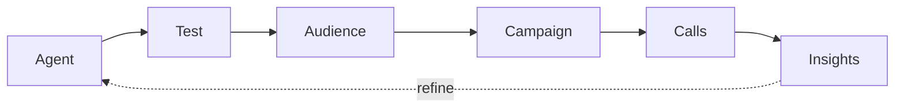

Every project in Intrlume follows the same loop: build an **agent**, test it, point it at an **audience**, run a **campaign**, and learn from the **calls** it makes. Insights from those calls feed straight back into a better agent.

## The pieces

<Steps>
  <Step title="Agent" icon="bot">
    The AI that talks on the call. It carries a prompt, a voice, one or more languages, an optional knowledge base, and tools. The easiest way to create one is to describe it in plain language and let Intrlume generate it.
  </Step>
  <Step title="Workflow" icon="workflow">
    The conversation flow behind the agent — the steps and branches that decide what it says and does next. Intrlume builds this for you; open the visual editor when you want precise control.
  </Step>
  <Step title="Audience" icon="users">
    Who you call. Upload a CSV of contacts; each row can carry custom fields (name, account, appointment time) that the agent uses on the call.
  </Step>
  <Step title="Campaign" icon="megaphone">
    A run of calls to an audience, on a schedule you set — calling window, timezone, retry rules, and how many calls run at once.
  </Step>
  <Step title="Calls" icon="phone">
    Each conversation, across three channels: **outbound** (you call them), **inbound** (they call you), and **web** (a click-to-talk widget). Intrlume records, transcribes, and tags the outcome of every call.
  </Step>
  <Step title="Insights" icon="bar-chart">
    Call logs, recordings, extracted data, analytics, and evaluation scores. Use them to spot what to fix, refine the agent, and run again.
  </Step>
</Steps>

## Where things live

<Columns cols={2}>
  <Card title="Core concepts" icon="layers" href="/concepts" horizontal>
    Detailed definitions of agents, workflows, knowledge bases, and more.
  </Card>
  <Card title="Quickstart" icon="rocket" href="/quickstart" horizontal>
    Put the loop into practice — build and test your first agent.
  </Card>
</Columns>
